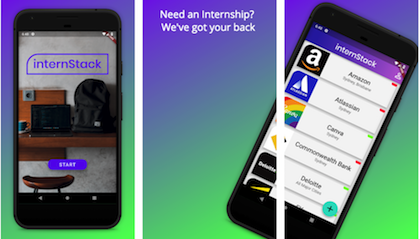

# internStack

[](https://circleci.com/gh/cbeardsmore/internStack/tree/master)

Australian Software Internships Listing built in Flutter. Features:

- Listing of 20+ companies
- Apply link to Company careers pages
- Share link with Friends
- Application reminder notifications 
- Submission form for new listings



## Download


## Build and Run

- The app can be be run on both Android and iOS simulators through VisualStudio Code
- Install [Flutter](https://flutter.dev/docs/get-started/install) and confirm installation:
	
	```bash
	flutter doctor
	```

- Build the APK:

	```bash
	flutter build apk
	```

- Run the app:

	```
	flutter run
	```


